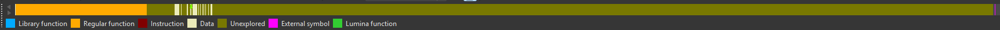
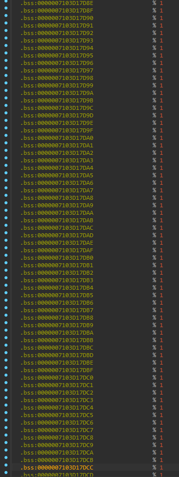
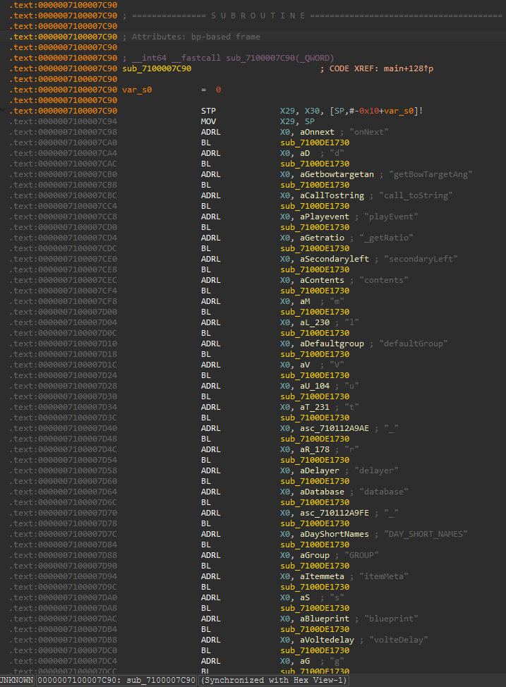

# Switch (NX)/Switch 2 (Ounce)

Because these platforms are cross-compatible (to an extent), they're lumped together here. Assuming you have a `title.keys` and a `prod.keys` dumped (😉) from a Switch, you can extract both the game's `main` (a custom-format NSO executable) and its `res.pak` with [NxFileViewer](https://github.com/Myster-Tee/NxFileViewer).

## `main`

Using [this IDA Pro plugin](https://github.com/pgarba/SwitchIDAProLoader), you can pretty easily load the executable into IDA. At first, you may glance at the top bar and exclaim to yourself, "Look at all that unexplored data! This must be JIT!". But if you exclaimed that, you would be, in fact, completely wrong.

In actuality, if you jump to those addresses, what you find is not beautiful, delicious Hashlink bytecode, but instead:

In fact, this main executable is indeed still just an HL/C compiled binary, which we can tell specifically by this telltale string initialization routine:

In retrospect, this is also obvious because the HL VM doesn't support ARM, which is what the Switch family uses (aarch64 and NVIDIA Tegra APUs).

## `res.pak`

This is another typical v0/1 PAK file that can be extracted with any standard PAKTool.
